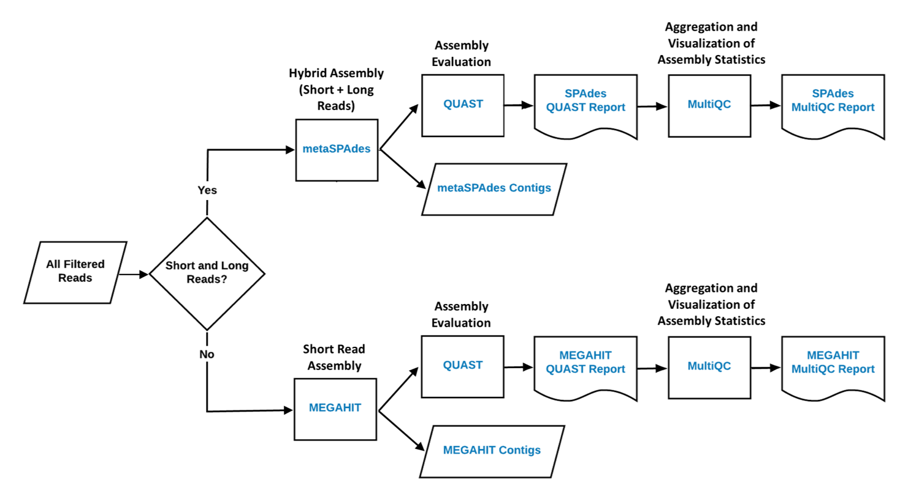

# Assembly Workflow

**The assembly workflow uses assembly-based approaches to give higher-confidence
gene identity assignment than raw read assignment alone.**

The assembly step determines the proper
order of the reads, and assembles the genome. The assembly tool
may use short reads (~350 or fewer reads), or it may use 
long reads (>1000 reads). 

Reads are assembled in order into contigs (chunks of contiguous
reads). The contigs are themselves assembled into scaffolds 
that consist of several contigs.

The SPAdes tool can handle short or long reads, while the megahit 
tool works better for short reads. 

Metaquast gives assembly statistics that can help evaluate the assembly
(how long, number of fragments, number of contigs, number of scaffolds, 
etc.).

More information:

* [Assembly Walkthrough](assembly_walkthru.md)
* [Assembly Snakemake Rules](assembly_snakemake.md)
* [`workflows/assembly/`](https://github.com/dahak-metagenomics/dahak/tree/master/workflows/assembly) directory in the repository

