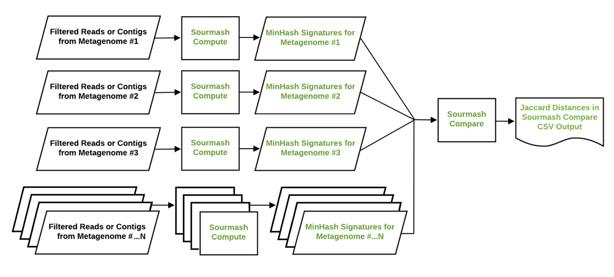

# Sample Comparison Workflow

 

**The sample comparison workflow helps perform rapid k-mer-based
ordination analyses of many samples to provide sample
groupings and identify potential outliers.**

Operating at the level of k-mers (representations of the reads),
the comparison step is taking the reads that were not fingerprinted
by the assembler and seeing if they match genomes of other organisms. 

The tool used for comparison is sourmash.

More information:

* [Comparison Walkthrough](comparison_walkthru.md)
* [Comparison Snakemake Rules](comparison_snakemake.md)
* [Comparison Snakemake Configuration](comparison_config.md)
* [`workflows/comparison/`](/workflows/comparison) directory in the repository

