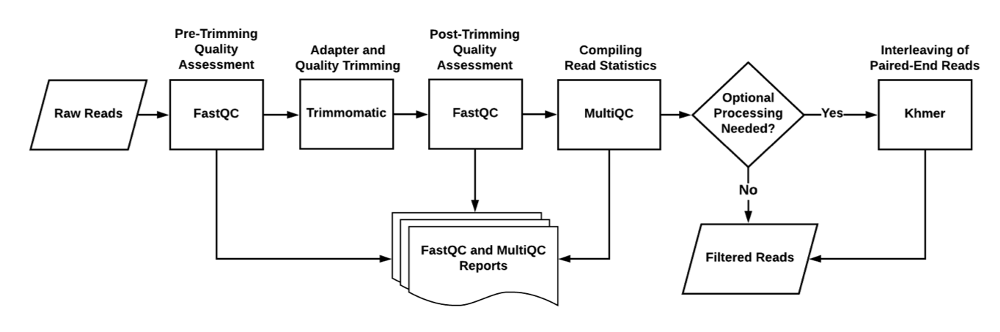

# Read Filtering Workflow

**The read filtering step consists of processing raw reads from a 
sequencer, such as discarding reads with a high uncertainty value
or trimming off adapters.**

Tools like Fastqc and Trimmomatic will perform this filtering 
process for the sequencer's reads.

More information:

* [Read Filtering Walkthrough](readfilt_walkthru.md)
* [Read Filtering Snakemake](readfilt_snakemake.md)
* [`workflows/readfilt/`](/workflows/readfilt) directory in the repository

