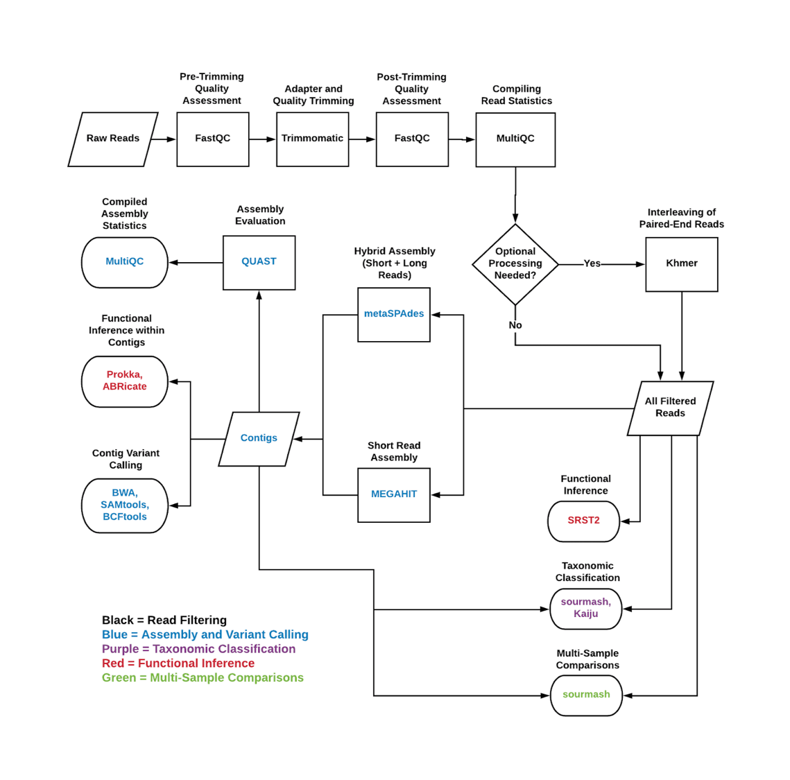

# Running Workflows

A flowchart illustrating how each workflow component fits 
together with tools into the overall process is included below:



Dahak workflows are run from the command line using Snakemake, a Python package
that provides similar capabilities to GNU make. Each workflow consists of a set
of Snakemake rules.

[Snakemake](https://snakemake.readthedocs.io/) is a Python program that assembles and
runs tasks using a task graph approach. See [Installing](installing.md) for
instructions on how to install it. 

Dahak workflows benefit directly from Snakemake's rich feature set and capabilities.
There is an extensive documentation page on [executing Snakemake](https://snakemake.readthedocs.io/en/stable/executable.html),
and its command line options. There are other projects demonstrating ways of creating 
[snakemake-profiles](https://github.com/snakemake-profiles/doc), or platform-specific
configuration profiles.

<br />
<br />

## How To Run Workflows

Generally, Snakemake is called by passing command line flags and the name of a
target file or rule name:

```bash
snakemake [FLAGS] <target>
```

### What targets are available?

Targets for each workflow are listed on the respective 
"Snakemake Rules" page for that workflow (see left side navigation menu).

There are two types of targets defined:

**Target Files:** The user can ask Snakemake to generate a particular file, and
Snakemake will dynamically determine the rules that are required to generate the
requested file. Snakemake uses a dependency graph to determine what rules to run
to generate the file.

**Build Rules:** There are rules that do not themselves do anything but that
trigger all of the rules in a given workflow. (The build rules work by
assembling filenames and passing target filenames to Snakemake.)


### What targets should I use?

Users should use the build rules to trigger workflows.

The build rules require workflow configuration details to be
set using Snakemake's configuration dictionary. See the
[Snakemake Configuration](config.md) page for details.

Each workflow has a set of "build rules" that will trigger
rules for a given workflow or portion of a workflow. Available
build rules for each workflow are listed on the respective 
"Snakemake Rules" page for that workflow (see left side navigation menu).

The build rules require some information about which read files
to run the workflow on; the information required is covered on
each "Snakemake Rules" page.

The [Quick Start](quickstart.md) covers some examples.


### How do I specify workflow parameters?

Workflow parameters are specified by passing a JSON configuration file to
Snakemake.


The default workflow parameter values are set in `default_workflowparams.settings`.
Any of these values can be overridden using a custom JSON file, as described
above and on the [Workflow Configuration](config.md) page. 

For example, to override the default version of trimmomatic (0.36) and use 0.38
instead, the following JSON would override the version to `0.38--5`:

```json
{
    "biocontainers" : {
        "trimmomatic" : {
            "use_local" : false,
            "quayurl" : "quay.io/biocontainers/trimmomatic",
            "version" : "0.38--5"
        }
    }
}
```

This can be placed in a JSON file like `config/custom_trimmomatic.json` (in
the `workflows/` directory) and passed to Snakemake using the `--config` flag like:

```bash
snakemake --config=config/custom_trimmomatic.json \
        [FLAGS] <target>
```


### How do I use Snakemake with Singularity?  

Singularity is a containerization technology similar to Docker but without the
need for root access. Snakefiles in Dahak contain `singularity:` directives,
which specify a Singularity image to pull and use to run the given commands.
These directives are ignored by default, Snakemake must be run with the
`--use-singularity` flag to run each command through a singularity container:

```bash
snakemake --use-singularity <target>
```

When Singularity containers are run, a host directory can be bind-mounted
inside the container to provide a shared-access folder on the host filesystem.

To specify a directory for Singularity to bind-mount, use the
`SINGULARITY_BINDPATH` environment variable:

```bash
SINGULARITY_BINDPATH="my_data:/data" snakemake --use-singularity <target>
```

This bind-mounts the directory `my_data/` into the Singularity container at `/data/`.


### Where will data files live?

To set the scratch/working directory for the Snakemake workflows, 
in which all intermediate and final data files will be placed, 
set the `data_dir` key in the Snakemake configuration dictionary. 
If this option is not set, it will be `data` by default.

(No trailing slash is needed when specifying the directory name.)

!!! warning "Singularity Bind Path"

    If you use a custom directory by setting the `data_dir` key,
    you must also adjust the `SINGULARITY_BINDPATH` variable
    accordingly.

For example, to put all intermediate files into the `work/` directory
instead of the `data/` directory, the following very short JSON file
could be used for the Snakemake configuration dictionary (this would 
use default values for everything except `data_dir`):

```json
{
    "data_dir" : "work"
}
```

This JSON file can be used as the Snakemake configuration dictionary
by passing the JSON file name to the `--configfile` flag to Snakemake
and updating the Singularity environment variable:

```bash
SINGULARITY_BINDPATH="work:/work" \
        snakemake --configfile=config/custom_scratch.settings \
        [FLAGS] <target>
```


### How do I customize my workflow with custom configuration files?

See the [Snakemake Configuration](config.md) page.


## Summary

All together, the command to run a Dahak workflow will 
look like this:

```bash
SINGULARITY_BINDPATH="data:/data" snakemake \
    --configfile my_workflow_params.json \
    --use-singularity \
    <target>
``` 
