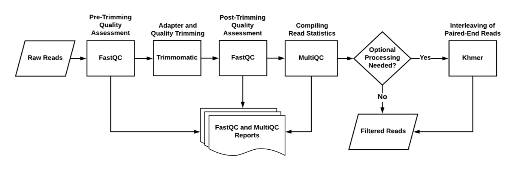

# Metagenomic Workflows

When analyzing metagenomic data, different workflows
are broken down into atomic operations. Each directory here
corresponds to an atomic operation (a workflow component).

A flowchart illustrating how each workflow component fits 
together with tools into the overall process is included below:

Each workflow has its own Snakefile. The Snakefile is composed of a 
list of simple rules that specify how an input file is turned into 
an output file. 

## Dahak Workflows

Dahak is designed to chain together tools for various tasks.  Each task is
accomplished by a component of a workflow, with some components being re-used
for multiple tasks.  This document describes the components that compose each
workflow.

## What's Here?

* Taxonomic characterization of bulk metagenome data sets with the sourmash
  tool against public and private reference databases;
* Assembly-based approaches to give higher-confidence gene identity assignment
  than raw read assignment alone;
* MinHash-based taxonomic description of data sets;
* Full-set and marker gene analysis of hybrid assembly/read collections to
  characterize taxonomic content;
* Full-set gene analysis of hybrid assembly/read collections to characterize
  functional content;
* Taxonomic and functional analysis performed on reads left out of the
  assembly;
* Rapid k-mer-based ordination analyses of many samples to provide sample
  groupings and identify potential outliers; and
* Interactive Jupyter notebooks for interpretation of results.

# List of Workflows

In the following diagrams, the colors denote the following:

* Blue - metagenome assembly, alignment, variant calling
* Red - contig annotation and gene assignment
* Purple -taxonomic and functional analysis of reads
* Green - sample comparison

Terminal software/outputs are denoted by ovals.

---

## Dataset Construction

See [`/dataset_construction`](/workflows/dataset_construction/) directory.

Constructs SBTs from external genomic databases and saves them to disk so that they can then be shared and loaded.

---

## Read Filtering and Quality Assessment of Datasets

The read filtering step consists of processing raw reads from a 
sequencer, such as discarding reads with a high uncertainty value
or trimming off adapters.

Tools like FastQC and Trimmomatic will perform this filtering 
process for the sequencer's reads.

**See [Read Filtering Workflow](workflow_readfilt.md) for an overview.**

Also see the [`read_filtering/`](/workflows/read_filtering/) directory.

---

## Taxonomic Classification Using Custom Database

---

## Assembly

The assembly step consists of software to determine the proper
order of the reads, and assemble the genome. The assembly tool
may use short reads (~350 or fewer base pairs), or it may use 
long reads (>1000 base pairs). 

Reads are assembled into contigs (chunks of contiguous
reads). The contigs are themselves assembled into scaffolds 
that consist of several contigs.

The SPAdes tool can handle short or long reads, while the MEGAHIT
tool works better for short reads. Pandaseq can merge overlapping reads.
Metaquast gives assembly statistics that can help evaluate the assembly
(how long, number of fragments, number of contigs, number of scaffolds, 
etc.).

**See [Assembly Workflow](#) (_in progress_) for instructions on
using this workflow.**

Also see [`assembly/`](/workflows/assembly/) directory.

---

## Abundance Estimation and Variance Calling

**See [Abundance Estimation/Variance Calling Workflow](#) (_in progress_) for
instructions on using this workflow.**

---

## Sub-Element Identification

**See [Sub-Element ID Workflow](#) (_in progress_) for instructions on using this
workflow.**

---

## Functional Inference

Once the assembly step has been completed, the assembly
can be analyzed and annotated using external databases.
Prokka is a tool for functional annotation of contigs.

Variant calling searches for common variants of a given 
gene. Variants are obtained by changing a few genes 
in an existing genome.

Dahak uses mi-faser to generate metabolic pathway models.

See [Functional Inference Workflow](#) (_in progress_) for an overview.

Also see the [`functional_inference/`](/workflows/functional_inference/) directory.

---

## Sample Comparison

Operating at the level of k-mers (representations of the reads),
the comparison step is taking the reads that were not fingerprinted
by the assembler and seeing if they match genomes of other organisms. 

The tool used for comparison is sourmash.

**See [Read Filtering Workflow](workflow_readfilt.md) for an overview.**

Also see the [`comparison/`](/workflows/comparison/) directory.

 

